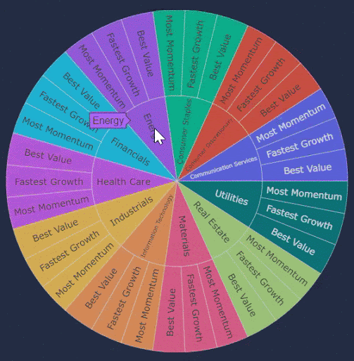

## Background

Prepare a dashboard that lays out your theme, coding approach, data munging techniques, and final visualization. Focus on telling a story through data visualizations:

The goal is to get a market insight of the S&P 500 , their individual sectors, and stocks within those sectors for a novice investor. Create a beautiful dashboard with performance graphics, company profiles, and relevant news:

3 questions to answer for my cllient for their own personal dashboard: 

How does S&P 500 index perform? 
What are the top 3;  best value stocks and  fastest earning growth stocks within each sector?  
Display the top 3 company profiles of the S&P 500 sectors for curious investors.


<!-- PROJECT SHIELDS -->
<!--
*** I'm using markdown "reference style" links for readability.
*** Reference links are enclosed in brackets [ ] instead of parentheses ( ).
*** See the bottom of this document for the declaration of the reference variables
*** for contributors-url, forks-url, etc. This is an optional, concise syntax you may use.
*** https://www.markdownguide.org/basic-syntax/#reference-style-links
-->
<!-- [![Ebay][ebay-shield]][ebay-url] -->
[![LinkedIn][linkedin-shield]][linkedin-url]
[![Facebook][facebook-shield]][facebook-url]
[![Twitter][twitter-shield]][twitter-url]
[![Kaggle][kaggle-shield]][kaggle-url]

<!-- TABLE OF CONTENTS -->
## Table of Contents
* [About Dataset](#about-dataset)
  * [Developing With](#developing-with)
* [Articles](#articles)
* [License](#license)
* [Contact](#contact)
* [Acknowledgements](#acknowledgements)


<!-- ABOUT -->
## About Dataset

  <br />
  <p align="center">
  <a href="https://github.com/dgustave/dgustave">
    
    <!--  -->
  </a>

  <h4 align="center">Created Data Set</h4>
   <h4 align="center"><strong>Scraped Investopedia, WSJ:</strong>What could do with this data?</h4>
   

  <p align="center">
    <p>  
We created a visualization dashboard website using visualizations we've created from external data. 
These visualizations include a Python Flask–powered RESTful API, HTML/CSS, JavaScript, and at least one database (SQL, MongoDB, SQLite, etc.). 
This dashboard should fall into one of the below four tracks: 
A custom “creative” D3.js dashboard containg powerful plots. 
A combination of web scraping and Leaflet or Plotly.
A dashboard page with multiple charts that update from the same data
A “thick” server that performs multiple manipulations on data in a database prior to visualization (must be approved).
This dashboard includes at least multiple JS libraries.
This dashboard is powered by a data set with at least 100 records.
This dashboard includes some level of user-driven interaction (e.g., menus, dropdowns, textboxes).
This final visualization includes at least three views. 

  <!-- <h4 align="center">View Notebook</h4>
  <p>Had to Render the notebook on a nbViewer which is linked to this image and will it is also on Kaggle just click on "K" at the top of the page.</p> -->
  <p align="center">
  <a href="">
    
  </a>


<!-- MARKDOWN LINKS & ICONS -->
<!-- https://www.markdownguide.org/basic-syntax/#reference-style-links -->
[license-shield]: icons/certified.png 
[license-url]: https://github.com/dgustave/README-Template/blob/master/LICENSE.txt>
[linkedin-url]: https://www.linkedin.com/in/donleygustave/
[linkedin-shield]: reports/icons/linkedin.png
[twitter-url]: https://twitter.com/donley_cg
[twitter-shield]: reports/icons/twitter.png
[facebook-url]: https://www.facebook.com/dgustave
[facebook-shield]: reports/icons/facebook.png
[kaggle-url]: https://www.kaggle.com/donleygustave/ebay-online-auction-notebook
[kaggle-shield]:  reports/icons/kaggle.png
[ebay-url]: https://careers.ebayinc.com/students-recent-grads/
[ebay-shield]:  reports/figures/ebay.png

<!-- MARKDOWN LINKS & IMAGES -->
<!-- [project-screenshot]: /reports/figures/bid_items.png -->


### Developing With


<!-- LICENSE -->
## License
Distributed under the MIT License. See `LICENSE` for more information.


<!-- CONTACT -->
## Contact
Donley Gustave - [@donley_cg](https://twitter.com/donley_cg) - donleyc.gustave@gmail.com


<!-- ACKNOWLEDGEMENTS -->
## Acknowledgements
<li> The template dashboard originated from <https://demos.creative-tim.com/material-dashboard-dark/examples/dashboard.html> </li>


<p><small>Project based on the <a target="_blank" href="https://drivendata.github.io/cookiecutter-data-science/">cookiecutter data science project template</a>. #cookiecutterdatascience</small></p>

<!-- Footer -->
<footer id="footer">
<p class="copyright">Copyright &copy; 2020 Gustave LLC
<br>Designed by <a rel="nofollow" href="https://www.facebook.com/dgustave">Donley Gustave</a></p>
</footer>


Project-2
==============================

Project-2 data set visualizations and data manipulations. 

## File Structure
Within the app you'll find the following base directory and files:

```
app/
├── assets/
|   ├── css/
|   |   ├── material-dashboard.css
|   |   └── material-dashboard.min.css
|   ├── demo/
|   ├── js/
|   |   ├── plugins
|   |   ├── core
|   |   ├── material-dashboard.js
|   |   ├── material-dashboard.js.map
|   |   └── material-dashboard.min.js
|   ├── scss/
|   |    ├── material-dashboard
|   |    └── material-dashboard.scss
|   └── img/
|
├── documentation/
├── templates/

```
## Resources
- Demo: <https://demos.creative-tim.com/material-dashboard-dark/examples/dashboard.html>
- Download Page: <https://www.creative-tim.com/product/material-dashboard-dark>
- Documentation: <https://demos.creative-tim.com/material-dashboard-dark/docs/2.0/getting-started/introduction.html>
- License Agreement: <https://www.creative-tim.com/license>
- Support: <https://www.creative-tim.com/contact-us>
- Issues: [Github Issues Page](https://github.com/creativetimofficial/material-dashboard/issues)
- [Material Kit](https://www.creative-tim.com/product/material-kit?ref=github-md-free) - For Front End Development


## Licensing

Gustave LLC Services © 2020. All Rights Reserved.

## Social Media

